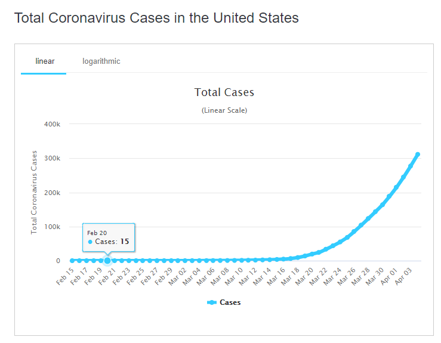

Scrapper for downloading country wise data present in charts at https://www.worldometers.info/coronavirus/country/us/, such as 



# Configuration

The code has been tested on windows 10. This makes use of chrome web driver. Make sure you download the web driver from here https://chromedriver.chromium.org/downloads.

Once that is done, make sure to update the ```config.py``` file. You will need to update the ```web_driver_path``` to the path of the downloaded chrome web-driver's executables.


# Download data

Once the configuration is done download the data by

```
cd <repo path>
python engine.py
```


# Requirements

```
python=3.7
bs4==0.0.1
selenium==3.141.0
tqdm==4.36.1
xlrd==1.2.0
XlsxWriter==1.2.8
pandas==0.25.2
numpy==1.16.5
```

# Download pre-fetched data

I will try to upload data daily . Latest dump is here https://datasetsgun.s3.amazonaws.com/data/data_05_04_20+18_14_35.zip


# Citation

Cite this project

```
@misc{Gunnvant2020,
  author = {Gunnvant, Saini},
  title = {Worldometer_Chart_Scrapper},
  year = {2020},
  publisher = {GitHub},
  journal = {GitHub repository},
}
```

